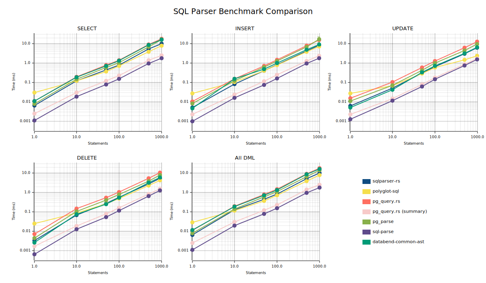

# SQL Parser Benchmark

[](https://github.com/LucaCappelletti94/sql_ast_benchmark/actions/workflows/ci.yml)
[](LICENSE)
[](https://www.rust-lang.org)

Benchmarking Rust SQL parsers using real-world PostgreSQL statements.

## Parsers Under Test

| Parser                                                           | Version | Commit                                                                                                      | Implementation               |
| ---------------------------------------------------------------- | ------- | ----------------------------------------------------------------------------------------------------------- | ---------------------------- |
| **[sqlparser-rs](https://github.com/sqlparser-rs/sqlparser-rs)** | 0.61.0  | [`8e36e8e`](https://github.com/sqlparser-rs/sqlparser-rs/commit/8e36e8ee85e8d24c3bd6948298a4675e341a1db3)   | Pure Rust                    |
| **[pg_query.rs](https://github.com/pganalyze/pg_query.rs)**      | 6.1.1   | [`35b8783`](https://github.com/pganalyze/pg_query.rs/commit/35b8783fda79636dd29d787765ca4a0978788f96)       | Rust FFI to C (libpg_query)  |
| **[pg_parse](https://github.com/paupino/pg_parse)**              | 0.12.0  | [`b231e37`](https://github.com/paupino/pg_parse/commit/b231e37972dc12b89bb404c574ee77e684c76eec)            | Rust FFI to C (libpg_query)  |
| **[sql-parse](https://github.com/antialize/sql-parse)**          | 0.28.0  | [`c7cf41f`](https://github.com/antialize/sql-parse/commit/c7cf41f372259d0c188ef2ebd8e931b4adac0301)         | Pure Rust (zero-copy)        |

### Parser Descriptions

- **sqlparser-rs**: A handwritten recursive descent parser supporting multiple SQL dialects (PostgreSQL, MySQL, SQLite, etc.). No external C dependencies. The most widely adopted Rust SQL parser.

- **pg_query.rs**: Rust bindings to libpg_query, which embeds PostgreSQL's actual parser extracted from the PostgreSQL source code. Provides 100% compatibility with PostgreSQL syntax.

- **pg_parse**: Another Rust binding to libpg_query, similar to pg_query.rs but with a different API design.

- **sql-parse**: A zero-copy parser using borrowed tokens for minimal allocations. Primarily focused on MySQL/MariaDB with experimental PostgreSQL support.

All parsers are configured for PostgreSQL dialect in this benchmark.

### Project Health & Metrics

| Metric                      | sqlparser-rs        | pg_query.rs     | pg_parse        | sql-parse  |
| --------------------------- | ------------------: | --------------: | --------------: | ---------: |
| **GitHub Stars**            |               3,312 |             226 |              88 |         25 |
| **Total Downloads**         |               50.8M |            1.0M |             11K |        53K |
| **Recent Downloads** (90d)  |                9.9M |            129K |             142 |      1.7K  |
| **Commits**                 |               1,867 |             103 |              52 |        138 |
| **Contributors**            |                190+ |              10 |               5 |          3 |
| **Open Issues**             |                 229 |               9 |               1 |          3 |
| **Last Commit**             |            Feb 2026 |        Dec 2025 |        May 2025 |   Oct 2025 |
| **First Release**           |            Feb 2018 |        Jan 2022 |        Feb 2021 |   Jan 2022 |
| **License**                 |          Apache-2.0 |             MIT |             MIT | Apache-2.0 |
| **Dependencies**            |            0 (core) | C (libpg_query) | C (libpg_query) |          0 |
| **Fuzzer**                  |                 Yes |              No |              No |         No |
| **WASM Support**            |                 Yes |              No |              No |        Yes |
| **Maintainer**              | Apache (DataFusion) |       pganalyze |      Individual | Individual |

**Key observations:**

- **sqlparser-rs** is by far the most mature and widely adopted, with 50x more downloads than the next closest competitor. It's now part of the Apache DataFusion project, ensuring long-term maintenance.
- **pg_query.rs** has solid adoption (1M downloads) and is maintained by pganalyze, a company that uses it in production for PostgreSQL query analysis.
- **pg_parse** and **sql-parse** are smaller projects with limited maintainer bandwidth. pg_parse hasn't been updated since May 2025.
- Only **sqlparser-rs** has fuzz testing, which is important for parser security and robustness.
- Pure Rust parsers (**sqlparser-rs**, **sql-parse**) support WASM targets; FFI-based parsers (**pg_query.rs**, **pg_parse**) require native compilation.

### Compatibility Notes

Not all parsers can parse all statements in our dataset. Compatibility was tested against our PostgreSQL statement corpus:

| Parser       | SELECT    | INSERT | UPDATE | DELETE |
| ------------ | --------: | -----: | -----: | -----: |
| sqlparser-rs |      100% |   100% |   100% |   100% |
| pg_query.rs  |      100% |   100% |   100% |   100% |
| pg_parse     |      100% |   100% |   100% |   100% |
| sql-parse    | **30.1%** |  97.8% |  95.8% |  95.7% |

**⚠️ sql-parse limitation**: sql-parse's PostgreSQL dialect support is incomplete. It fails to parse ~70% of SELECT statements in our corpus (primarily those using PostgreSQL-specific syntax like `DISTINCT ON`, complex subqueries, or certain join patterns). Results for sql-parse should be interpreted with this caveat—it may appear faster on SELECT benchmarks because it's parsing a simpler subset of statements that happen to succeed.

## Benchmark Methodology

### What is Measured

Each benchmark measures the time to parse a batch of SQL statements concatenated with semicolons into a single string. For example, parsing 100 statements means parsing a string like:

```sql
SELECT * FROM t1; SELECT * FROM t2; ... ; SELECT * FROM t100
```

The parser must tokenize and build an AST for all statements in the batch. We measure wall-clock time for the complete parsing operation.

### Benchmark Configuration

- **Framework**: [Criterion.rs](https://github.com/bheisler/criterion.rs) v0.8
- **Sampling**: Flat sampling mode, 50 samples per benchmark
- **Measurement time**: 3 seconds per benchmark
- **Batch sizes**: 1, 10, 50, 100, 500, 1000 statements

### Datasets

All SQL statements are validated to parse successfully with sqlparser-rs and pg_query.rs before inclusion. Other parsers may fail on some statements (see Compatibility Notes above).

| Dataset       | Source                                                                       | Count | Description                                                                                    |
| ------------- | ---------------------------------------------------------------------------- | ----: | ---------------------------------------------------------------------------------------------- |
| Spider SELECT | [Yale Spider](https://yale-lily.github.io/spider)                            | 4,505 | Real queries from the Spider text-to-SQL benchmark, covering 200 databases across 138 domains |
| Gretel SELECT | [Gretel AI](https://huggingface.co/datasets/gretelai/synthetic_text_to_sql)  | 1,897 | Synthetic queries generated by LLMs, designed to be realistic                                 |
| Gretel INSERT | Gretel AI                                                                    |   992 | INSERT statements with VALUES and subqueries                                                  |
| Gretel UPDATE | Gretel AI                                                                    |   983 | UPDATE statements with WHERE clauses and expressions                                          |
| Gretel DELETE | Gretel AI                                                                    |   933 | DELETE statements with subqueries and conditions                                              |

## Results



### SELECT Statements

| Statements | sqlparser-rs    | pg_query.rs     | pg_parse        | sql-parse |
| ---------: | --------------: | --------------: | --------------: | --------: |
|          1 |            7 µs |           11 µs |            8 µs |      3 µs |
|         10 |          131 µs |          206 µs |          146 µs |     75 µs |
|         50 |          463 µs |          856 µs |          605 µs |    279 µs |
|        100 |          875 µs |         1.57 ms |         1.07 ms |    529 µs |
|        500 |         5.68 ms |         10.0 ms |         6.73 ms |   3.53 ms |
|       1000 |  18.5 ms ± 27%  |  29.2 ms ± 36%  |  16.4 ms ± 24%  |   6.65 ms |

*Note: The 1000-statement SELECT benchmark shows high variance (±24-36%) that persists across multiple runs. This likely reflects the heterogeneous complexity of the Spider/Gretel query corpus—some queries are simple while others contain deeply nested subqueries, CTEs, and complex expressions. The sql-parse results show lower variance because it fails on the most complex queries, effectively benchmarking a simpler subset.*

### INSERT Statements

| Statements | sqlparser-rs |  pg_query.rs | pg_parse | sql-parse |
| ---------: | -----------: | -----------: | -------: | --------: |
|          1 |         6 µs |        11 µs |     8 µs |      3 µs |
|         10 |        88 µs |       171 µs |   124 µs |     60 µs |
|         50 |       422 µs |       763 µs |   635 µs |    278 µs |
|        100 |       896 µs |      1.58 ms |  1.31 ms |    631 µs |
|        500 |      4.90 ms |      8.90 ms |  6.74 ms |   3.18 ms |

### UPDATE Statements

| Statements | sqlparser-rs | pg_query.rs | pg_parse | sql-parse |
| ---------: | -----------: | ----------: | -------: | --------: |
|          1 |         7 µs |       16 µs |    11 µs |      5 µs |
|         10 |        59 µs |      108 µs |    73 µs |     45 µs |
|         50 |       325 µs |      606 µs |   430 µs |    248 µs |
|        100 |       692 µs |     1.32 ms |  1.01 ms |    555 µs |
|        500 |      3.20 ms |     6.46 ms |  4.44 ms |   2.70 ms |

### DELETE Statements

| Statements | sqlparser-rs | pg_query.rs | pg_parse | sql-parse |
| ---------: | -----------: | ----------: | -------: | --------: |
|          1 |         3 µs |        7 µs |     4 µs |      2 µs |
|         10 |        72 µs |      147 µs |   108 µs |     47 µs |
|         50 |       290 µs |      558 µs |   398 µs |    187 µs |
|        100 |       607 µs |     1.13 ms |   790 µs |    415 µs |
|        500 |      2.93 ms |     5.66 ms |  3.95 ms |   2.12 ms |

### Mixed DML Statements

| Statements | sqlparser-rs | pg_query.rs | pg_parse | sql-parse |
| ---------: | -----------: | ----------: | -------: | --------: |
|          1 |         7 µs |       12 µs |     8 µs |      3 µs |
|         10 |       134 µs |      208 µs |   144 µs |     77 µs |
|         50 |       459 µs |      822 µs |   605 µs |    281 µs |
|        100 |       856 µs |     1.52 ms |  1.10 ms |    541 µs |
|        500 |      5.94 ms |     10.9 ms |  6.67 ms |   3.65 ms |
|       1000 |      14.7 ms |     22.5 ms |  14.3 ms |   6.70 ms |

## Interpretation

### Performance Ranking

Across all statement types and batch sizes, the parsers consistently rank:

1. **sql-parse** (fastest) — 1.5-2x faster than sqlparser-rs
2. **sqlparser-rs** — 1.3-1.5x faster than pg_parse
3. **pg_parse** — 1.5-1.7x faster than pg_query.rs
4. **pg_query.rs** (slowest)

### Key Findings

#### 1. sql-parse is the fastest parser, but with major caveats

sql-parse achieves its speed through zero-copy parsing with borrowed tokens, minimizing allocations. However, it only successfully parses ~30% of SELECT statements in our corpus due to incomplete PostgreSQL dialect support. Its benchmark numbers reflect parsing a simpler subset of SQL, making direct comparisons misleading.

#### 2. sqlparser-rs offers the best speed/compatibility balance

At roughly 1.7-2x faster than pg_query.rs while maintaining 100% compatibility with our test corpus, sqlparser-rs is the practical choice for most applications. It handles the full range of PostgreSQL syntax without external dependencies.

#### 3. FFI overhead is measurable but not dramatic

pg_query.rs and pg_parse (both wrapping libpg_query via FFI) are 1.5-2x slower than pure Rust parsers. This overhead comes from:

- Crossing the Rust-C boundary on every parse call
- Converting C data structures (protobuf) to Rust types
- The PostgreSQL parser's design for correctness over speed

#### 4. pg_parse consistently outperforms pg_query.rs

Despite both using libpg_query, pg_parse is ~1.5x faster than pg_query.rs. This likely reflects differences in how each library handles the FFI bridge and deserializes the parse tree.

#### 5. All parsers scale linearly

Parsing time grows linearly with statement count, as expected. No parser shows degradation at scale—parsing 1000 statements takes approximately 1000x the time of parsing 1 statement.

#### 6. Statement complexity affects relative performance

DELETE statements (simplest) show the largest relative gaps between parsers, while complex SELECT statements narrow the gap slightly. This suggests FFI overhead is more significant relative to parse time for simple statements.

#### 7. High variance at large batch sizes reflects query heterogeneity

The 1000-statement SELECT benchmark shows persistent high variance (±24-36% standard deviation) that does not decrease with repeated runs. This is not measurement noise—it reflects the diverse complexity of real-world SQL in the Spider/Gretel corpus. Individual benchmark iterations sample different subsets of queries, and batches containing more complex queries (nested subqueries, CTEs, window functions) take measurably longer than batches of simpler queries. Interestingly, sql-parse shows much lower variance because it fails to parse the most complex queries, effectively self-selecting a more homogeneous (simpler) subset.

### Trade-offs

| Consideration                | sqlparser-rs                    | pg_query.rs / pg_parse      | sql-parse                 |
| ---------------------------- | ------------------------------- | --------------------------- | ------------------------- |
| **Speed**                    | Fast                            | Slower (FFI overhead)       | Fastest (zero-copy)       |
| **PostgreSQL compatibility** | Good (may differ on edge cases) | Perfect (actual PG parser)  | Limited (~30% SELECT)     |
| **Memory allocation**        | Standard                        | Standard                    | Minimal (borrowed tokens) |
| **Dependencies**             | None                            | C library (libpg_query)     | None                      |
| **Multi-dialect support**    | Yes (MySQL, SQLite, etc.)       | PostgreSQL only             | MySQL/MariaDB focus       |
| **Query fingerprinting**     | No                              | Yes                         | No                        |

### Recommendations

- **General use**: **sqlparser-rs** — best balance of speed, compatibility, and multi-dialect support
- **PostgreSQL tooling** (query analysis, rewriting): **pg_query.rs** — guaranteed syntax compatibility with PostgreSQL, plus fingerprinting support
- **High-throughput ingestion** of simple/known SQL: **sql-parse** — if your SQL subset is supported and you need minimal allocations
- **Embedded/WASM targets**: **sqlparser-rs** or **sql-parse** — no C dependencies

## Environment

Benchmarks were run on:

- **CPU**: AMD Ryzen Threadripper PRO 5975WX (32 cores, 64 threads)
- **OS**: Ubuntu 24.04 (Linux 6.14)
- **Rust**: 2021 edition (stable)

### System Requirements

- **Rust toolchain**: stable (2021 edition)
- **C compiler**: Required for pg_query.rs and pg_parse (they build libpg_query from source)
- **libclang**: Required for bindgen (used by FFI parsers)

On Ubuntu/Debian:

```bash
sudo apt install build-essential libclang-dev
```

## Running Benchmarks

```bash
cargo bench
```

Results are saved to `target/criterion/` with HTML reports.

## Generating Plots

```bash
cargo run --release --bin plot
```

Creates `benchmark_results.svg` with line charts comparing all four parsers.

## Reproducibility

This benchmark uses git dependencies to track the latest versions of each parser. For exact reproducibility:

1. The commit hashes in the "Parsers Under Test" table indicate the exact versions benchmarked
2. Benchmark results may vary between runs due to system load and thermal conditions
3. The high variance in SELECT/DML 1000-statement benchmarks is inherent to the heterogeneous query corpus

To pin specific versions, replace git dependencies in `Cargo.toml` with version numbers from crates.io.

## Development

### Pre-commit Hooks

This project includes pre-commit hooks for formatting and linting. To enable:

```bash
git config core.hooksPath .githooks
```

The hook runs `cargo fmt --check` and `cargo clippy` before each commit.

### Code Style

- Format with `cargo fmt`
- Lint with `cargo clippy` (pedantic + nursery warnings enabled)
- No unsafe code allowed

## License

MIT
