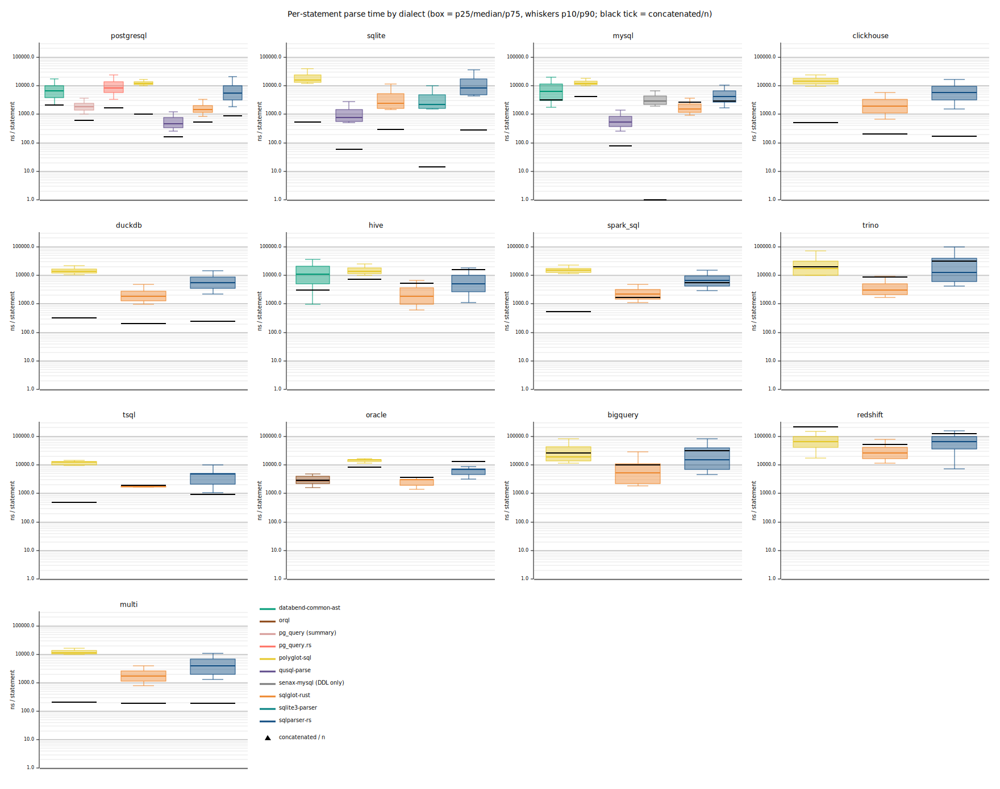

# SQL Parser Benchmark

[](https://github.com/LucaCappelletti94/sql_ast_benchmark/actions/workflows/ci.yml)
[](LICENSE)
[](https://www.rust-lang.org)

Benchmarking Rust SQL parsers on a real-world, multi-dialect corpus of 311,594 statements across 13 SQL dialects (PostgreSQL, MySQL, SQLite, ClickHouse, DuckDB, Hive, Spark SQL, Trino, T-SQL, Oracle, BigQuery, Redshift, plus a mixed-dialect set). Each parser is run in its best-matching dialect, and "correct" is graded against a real reference parser where one exists.

See [CHANGELOG.md](CHANGELOG.md) for the project history.

## Parsers Under Test

| Parser | Version | Source | Implementation | Dialects |
| --- | --- | --- | --- | --- |
| **[sqlparser-rs](https://github.com/sqlparser-rs/sqlparser-rs)** | 0.62.0 | git [`182eae8`](https://github.com/sqlparser-rs/sqlparser-rs/commit/182eae8191962985d3e668895c66841e420d6258) | Pure Rust, handwritten recursive descent | 14 dedicated dialects |
| **[sqlglot-rust](https://crates.io/crates/sqlglot-rust)** | 0.9.28 | crates.io | Pure Rust, standalone port of Python sqlglot | 30 (parser currently dialect-agnostic) |
| **[polyglot-sql](https://github.com/tobilg/polyglot)** | 0.4.1 | git [`dbdead6`](https://github.com/tobilg/polyglot/commit/dbdead65405449825923b3834a09bfc0d2c8bc4e) | Pure Rust, transpiler | 32 |
| **[pg_query.rs](https://github.com/pganalyze/pg_query.rs)** | 6.1.1 | git [`7e189a9`](https://github.com/pganalyze/pg_query.rs/commit/7e189a9dd1d4e441a2d44e6655c793f101bba3fa) | Rust FFI to C (libpg_query) | PostgreSQL (the PostgreSQL oracle) |
| **[pg_parse](https://github.com/paupino/pg_parse)** | 0.14.0 | git [`4e7f10c`](https://github.com/paupino/pg_parse/commit/4e7f10ce401337f070b82bfc267c5aa38b262e25) | Rust FFI to C (libpg_query), alternate API | PostgreSQL (optional feature) |
| **[qusql-parse](https://crates.io/crates/qusql-parse)** | 0.8.0 | crates.io | Pure Rust, zero-copy | PostgreSQL, MariaDB/MySQL, SQLite |
| **[databend-common-ast](https://github.com/datafuselabs/databend)** | 0.2.5 | crates.io | Pure Rust, zero-copy, Pratt | PostgreSQL, MySQL, Hive |
| **[sqlite3-parser](https://crates.io/crates/sqlite3-parser)** (lemon-rs) | 0.16.0 | crates.io | Generated from SQLite's Lemon grammar | SQLite (the SQLite oracle) |
| **[orql](https://codeberg.org/xitep/orql)** | 0.1.0 | git [`6a5391b`](https://codeberg.org/xitep/orql/commit/6a5391b1b11f5771ab15e4ba519bdf00fdacc021) | Pure Rust, early-stage | Oracle (SELECT only) |
| **[senax-mysql-parser](https://crates.io/crates/senax-mysql-parser)** | 0.1.10 | crates.io | Pure Rust, nom | MySQL **CREATE TABLE only** |

### Parser notes

- **sqlparser-rs**: the most widely adopted Rust SQL parser (part of Apache DataFusion). Has dedicated dialects for PostgreSQL, MySQL, SQLite, ClickHouse, Hive, MsSql, MySql, Oracle, Redshift, BigQuery, DuckDB, Databricks, Snowflake, ANSI and Generic. Trino maps to Generic and Spark SQL maps to Databricks in this benchmark.
- **sqlglot-rust**: a from-scratch Rust port of Python's sqlglot with a full AST, a SQL generator (so it round-trips), and an optimizer. In this version the parser itself is dialect-agnostic (the dialect argument only affects generation), so its acceptance rate does not change between dialects.
- **polyglot-sql**: a SQL parsing, formatting and transpilation library covering 32 dialects. It is very permissive: on oracle-backed dialects it has a high false-positive rate (it accepts large amounts of SQL the reference parser rejects), so high acceptance numbers should be read alongside its false-positive rate.
- **pg_query.rs**: Rust bindings to libpg_query, which embeds PostgreSQL's actual parser. It is the **ground-truth oracle for the PostgreSQL corpus**, not just another parser under test.
- **pg_query.rs (summary)**: `pg_query::summary()` extracts metadata without deserializing the full AST. Same accept/reject decisions as full parse, much faster.
- **qusql-parse**: a zero-copy hand-coded parser focused on MySQL/MariaDB and PostgreSQL, with SQLite support added in 0.8. Can `todo!()`-panic on some unimplemented paths, which the benchmark treats as a parse failure.
- **databend-common-ast**: a custom parser built by the Databend team for speed. PostgreSQL, MySQL and Hive modes are exercised here.
- **sqlite3-parser (lemon-rs)**: generated from SQLite's own Lemon grammar, so it is the closest thing to real-SQLite parity in Rust. It is the **ground-truth oracle for the SQLite corpus**.
- **orql**: an early-stage Oracle-dialect parser, SELECT only, included at its [author's request](https://github.com/LucaCappelletti94/sql_ast_benchmark/issues/1). No pretty-printer, so round-trip and fidelity are N/A.
- **senax-mysql-parser**: the only maintained descendant of nom-sql, but it parses **CREATE TABLE statements only**. It therefore reads close to 0% on SELECT-heavy corpora and only registers on DDL. It is included as a DDL-only data point and labeled as such everywhere.

## Methodology

### Multi-dialect mapping

The corpus is organised as `datasets/{dialect}/{name}.txt`, one statement per line. For each dialect, every parser that models that dialect is run with its matching dialect setting. Parsers that do not model a dialect are reported as N/A for it. For example the Oracle corpus is parsed by sqlparser-rs (Oracle dialect), polyglot-sql (Oracle), sqlglot-rust and orql, but not by pg_query, qusql-parse, databend, sqlite3-parser or senax.

### Defining "correct"

There is no universal oracle across dialects, so correctness is defined per dialect:

- **Oracle-backed dialects.** PostgreSQL is graded against **pg_query** (libpg_query, the actual PostgreSQL parser) and SQLite against **sqlite3-parser / lemon-rs** (SQLite's real grammar). The oracle splits the corpus into valid (oracle accepts) and invalid (oracle rejects), and every parser is scored on four metrics:
  - **Recall**: of oracle-valid statements, how many the parser accepts. Higher is better.
  - **False positives**: of oracle-invalid statements, how many the parser wrongly accepts. Lower is better.
  - **Round-trip**: of accepted-valid statements, whether parse, print, re-parse, re-print is stable. Higher is better. N/A without a printer.
  - **Fidelity**: of accepted-valid statements, whether the oracle's canonical form of the parser's output equals the oracle's canonical form of the input (semantic preservation, not just self-consistency). Higher is better. N/A without a printer.
- **Provenance dialects.** The other 11 dialects have no oracle. Statements are drawn from each dialect's own test suites and official samples, so they are treated as provenance-valid and the metric is **acceptance rate** (fraction of the corpus the parser accepts in its matching dialect) plus **round-trip** stability.

### Performance

The performance benchmark (`cargo bench`) is keyed to each parser's accepted set. For every (parser, dialect) pair it builds the set of statements that parser accepts in that dialect and times each accepted statement individually to produce a per-statement parse-time distribution. Per-statement timing uses an adaptive iteration count (best of several rounds) and a no-`catch_unwind` parse path, so the measurement is free of panic-guard overhead. Every accepted statement is timed (no sampling); the full corpus is covered.

Raw per-statement times are written to `target/bench_dist/{dialect}__{parser}.txt` and percentiles plus the round-trip rate to `target/bench_dist/summary.csv`, so plots can be regenerated without re-running. `cargo run --release --bin sqlbench plot` renders `benchmark_results.svg`: one subplot per dialect with an empirical CDF (eCDF) line per parser (x = per-statement time in ns on a log scale, y = fraction of that parser's accepted statements parsed within that time).

## Dataset Corpus

311,594 statements across 34 files and 13 dialects. The corpus is committed pre-built and compressed as `datasets.tar.zst` (5.3 MB). Extract it before running anything:

```bash
tar --zstd -xf datasets.tar.zst   # produces datasets/{dialect}/{name}.txt
```

The original fetch/extraction tooling that scraped these statements from upstream repositories and datasets has been removed; the compressed corpus is the source of truth (see git history for the downloader).

| Dialect | Files | Statements | Example sources |
| --- | ---: | ---: | --- |
| clickhouse | 2 | 92,268 | ClickHouse stateless tests, ClickBench |
| hive | 2 | 41,294 | Apache Hive clientpositive, hive-testbench |
| duckdb | 3 | 41,148 | DuckDB test/sql + benchmark, DataFusion slt |
| mysql | 4 | 30,220 | TiDB integration tests, Dolt, employees db, TPC-H |
| postgresql | 3 | 29,402 | PostgreSQL regress suite + contrib + test modules, defog-ai |
| oracle | 2 | 21,648 | Oracle sample schemas and examples |
| tsql | 2 | 14,782 | ANTLR T-SQL examples, Stack Exchange Data Explorer |
| spark_sql | 3 | 14,464 | Spark sql-tests, ClickBench, spark-sql-perf |
| sqlite | 2 | 12,119 | Spider, sql-create-context |
| multi | 1 | 10,962 | sqlfluff dialect fixtures |
| redshift | 3 | 2,992 | redshift-benchmarks, redshift-utils, ClickBench |
| bigquery | 2 | 224 | TPC for BigQuery, ClickBench |
| trino | 2 | 71 | Trino parser tests, ClickBench |

All sources are openly licensed (Apache-2.0, MIT, BSD, public domain or CC-BY). Natural-language-with-embedded-SQL datasets are intentionally excluded.

## Correctness Results

Run on the full corpus with:

```bash
cargo run --release --bin sqlbench correctness
```

### PostgreSQL (oracle: pg_query / libpg_query)

27,844 oracle-valid and 1,558 oracle-invalid statements.

| Parser | Recall | False positives | Round-trip | Fidelity |
| --- | ---: | ---: | ---: | ---: |
| pg_query.rs (oracle) | 100.0% | 0.0% | 99.9% | 99.9% |
| pg_query (summary) | 100.0% | 0.0% | N/A | N/A |
| sqlparser-rs | 88.6% | 11.0% | 100.0% | 98.8% |
| polyglot-sql | 84.6% | 27.5% | 98.6% | 91.1% |
| qusql-parse | 76.5% | 11.2% | N/A | N/A |
| sqlglot-rust | 54.7% | 1.3% | 99.7% | 94.9% |
| databend-common-ast | 46.4% | 6.4% | 99.8% | 86.4% |

### SQLite (oracle: sqlite3-parser / lemon-rs)

12,040 oracle-valid and 79 oracle-invalid statements.

| Parser | Recall | False positives | Round-trip | Fidelity |
| --- | ---: | ---: | ---: | ---: |
| sqlite3-parser (oracle) | 100.0% | 0.0% | 100.0% | 100.0% |
| sqlparser-rs | 99.9% | 25.3% | 100.0% | 100.0% |
| polyglot-sql | 99.9% | 29.1% | 99.6% | 92.3% |
| qusql-parse | 99.2% | 1.3% | N/A | N/A |
| sqlglot-rust | 99.2% | 17.7% | 100.0% | 73.4% |

### Provenance dialects (acceptance rate, no oracle)

Acceptance rate = fraction of each dialect's own corpus accepted, with the parser run in its matching dialect. Round-trip stability of accepted statements is in parentheses.

| Dialect (stmts) | sqlparser-rs | polyglot-sql | sqlglot-rust | dialect-specific |
| --- | ---: | ---: | ---: | --- |
| clickhouse (92,268) | 79.5% (100%) | 99.9% (98%) | 56.0% (99%) | -- |
| hive (41,294) | 80.5% (100%) | 84.3% (97%) | 45.6% (100%) | databend 51.7% |
| duckdb (41,148) | 92.1% (100%) | 93.6% (99%) | 63.0% (99%) | -- |
| mysql (30,220) | 75.8% (99%) | 76.1% (98%) | 46.7% (100%) | qusql 64.2%, databend 54.9%, senax 7.0% (DDL only) |
| oracle (21,648) | 59.2% (100%) | 59.6% (100%) | 54.3% (100%) | orql 0.3% (SELECT only) |
| tsql (14,782) | 72.1% (100%) | 74.8% (99%) | 53.9% (99%) | -- |
| spark_sql (14,464) | 85.1% (100%) | 91.7% (96%) | 58.9% (100%) | -- |
| multi (10,962) | 45.6% (100%) | 67.0% (98%) | 16.4% (99%) | -- |
| redshift (2,992) | 92.1% (100%) | 91.5% (99%) | 79.4% (100%) | -- |
| bigquery (224) | 99.1% (100%) | 99.1% (73%) | 75.0% (92%) | -- |
| trino (71) | 98.6% (100%) | 98.6% (100%) | 56.3% (100%) | -- |

### Key correctness findings

- **pg_query and sqlite3-parser are the oracles** and score 100% by construction. They are the right choice when correctness must equal "what the database actually accepts."
- **sqlparser-rs** has the best balance among the general-purpose parsers: high recall (88.6% PostgreSQL, 99.9% SQLite) with the highest fidelity of the pure-Rust parsers (98.8% PostgreSQL, 100% SQLite). Its false-positive rate is moderate (11.0% PostgreSQL, 25.3% SQLite): its dialects are looser than the real databases.
- **polyglot-sql** is the most permissive parser. It posts very high acceptance and recall (99.9% SQLite, 99.9% ClickHouse) but also the highest PostgreSQL false-positive rate (27.5%): it accepts SQL the reference parser rejects.
- **sqlglot-rust** is the most conservative on PostgreSQL (54.7% recall, only 1.3% false positives) with strong PostgreSQL fidelity (94.9%), but the lowest SQLite fidelity (73.4%) - its SQLite reprints often diverge from the original. Because its parser is dialect-agnostic in this version, its acceptance is uniform across dialects rather than tuned per dialect.
- **databend-common-ast** has moderate recall and a low false-positive rate, reflecting its Databend/ClickHouse focus rather than broad PostgreSQL coverage.
- **The hardest provenance dialects are the mixed `multi` fixtures (~46%, intentionally cross-dialect) and Oracle (~59%)** for the general-purpose parsers, reflecting cross-dialect and SQL\*Plus syntax; BigQuery, Trino and Redshift are well-supported (90%+ by sqlparser-rs and polyglot-sql), with MySQL and T-SQL in the low-to-mid 70s.
- **senax-mysql-parser** reads 7.0% on the MySQL corpus, consistent with it being a CREATE TABLE-only parser on a SELECT-heavy corpus.

## Coverage Results

A per-file acceptance breakdown (every dataset file, every supporting parser, in the dialect's matching dialect) is produced by:

```bash
cargo run --release --bin sqlbench correctness --per-file
```

## Performance Results

`cargo bench` times every accepted statement in every dialect (full corpus, no sampling) and writes raw per-statement times + percentiles to `target/bench_dist/`. `cargo run --release --bin sqlbench plot` renders two views of the same data.

Each subplot is titled with the dialect and its total statement count, and carries its own legend listing only the parsers run in that dialect. Every legend entry pairs the parser with two quality metrics so speed can be read against coverage and correctness at a glance: `fail%` (share of the dialect corpus the parser did not accept) and `RT%` (Display round-trip rate among the statements it accepted, i.e. how often pretty-printing is stable, shown as `n/a` for parsers without a pretty-printer).

The eCDF view (one subplot per dialect) shows, for each parser, the empirical CDF of per-statement parse time: x = ns per statement (log), y = fraction of that parser's accepted statements parsed within that time, so a curve further to the left is faster.


The box-plot view summarises the same per-statement distributions (box = p25/median/p75, whiskers = p10/p90, log-y).



PostgreSQL example (ns per statement; `n` is each parser's own accepted count, so the rows are not directly comparable on volume; `fail%` = share of the corpus the parser rejected; `RT%` = Display round-trip rate among accepted, N/A without a pretty-printer):

| Parser | median | p90 | fail% | RT% |
| --- | ---: | ---: | ---: | ---: |
| qusql-parse | 509 | 1,273 | 27% | N/A |
| sqlglot-rust | 1,455 | 3,494 | 48% | 100% |
| pg_query (summary) | 1,881 | 3,808 | 5% | N/A |
| sqlparser-rs | 4,254 | 12,034 | 15% | 100% |
| databend-common-ast | 6,949 | 18,168 | 56% | 100% |
| pg_query.rs (full) | 8,962 | 25,692 | 5% | 100% |
| polyglot-sql | 12,502 | 17,844 | 18% | 99% |

Key observations:

- **qusql-parse and sqlglot-rust are the fastest per statement**; the libpg_query FFI (`pg_query.rs`) is the slowest full parser per call, and `pg_query (summary)` is much faster than full parsing because it skips AST deserialization.
- **polyglot-sql has a high, flat per-statement floor** (~9-15 us in every dialect, visible as boxes that never drop low) from fixed per-call overhead.
- **Speed trades off against coverage.** The fastest parsers also reject the most: qusql-parse and sqlglot-rust are quickest but reject 27% and 48% of the PostgreSQL corpus, while sqlparser-rs and the pg_query family accept far more at a higher per-statement cost.
- **Round-trip is stable where a printer exists.** Among parsers that pretty-print, Display round-trip rates are ~99-100% in most dialects (BigQuery polyglot-sql is a low outlier); parsers without a printer (qusql-parse, pg_query summary, orql, senax) are N/A.

## Running

```bash
tar --zstd -xf datasets.tar.zst                # extract the corpus into datasets/
cargo run --release --bin sqlbench correctness --per-file    # per-file acceptance, every dialect
cargo run --release --bin sqlbench correctness          # oracle + provenance correctness
cargo bench                                     # parse-throughput, every dialect
```

The default build uses pg_query (the PostgreSQL oracle). To use the alternate libpg_query binding instead:

```bash
cargo run --release --no-default-features --features pg_parse_parser --bin sqlbench correctness
```

## Environment

- **CPU**: AMD Ryzen Threadripper PRO 5975WX (32 cores, 64 threads)
- **OS**: Ubuntu 24.04 (Linux 6.17)
- **Rust**: 2021 edition (stable)

### System requirements

- Rust toolchain (stable, 2021 edition)
- A C compiler and `libclang` for the FFI parsers (pg_query / pg_parse build libpg_query from source)

On Ubuntu/Debian:

```bash
sudo apt install build-essential libclang-dev
```

## Notes on robustness

Several recursive-descent parsers can overflow the stack on deeply nested SQL, and a stack overflow aborts the process (it is not catchable by `catch_unwind`). The coverage and correctness runners therefore execute parsing on worker threads with a 512 MiB stack. Parsers that panic on edge cases (qusql-parse, polyglot-sql, databend, sqlite3-parser, sqlglot-rust, orql, senax) are wrapped in `catch_unwind`, which treats a panic as a parse failure.

## Reproducibility

Git dependencies track the latest commit of each parser; the commit hashes in the Parsers Under Test table identify the exact versions benchmarked. To pin versions, replace the git dependencies in `Cargo.toml` with crates.io version numbers.

## Development

```bash
git config core.hooksPath .githooks   # enable fmt + clippy pre-commit hooks
cargo fmt --all
cargo clippy --all-targets
```

No unsafe code is allowed (`unsafe_code = "forbid"`). Clippy runs with pedantic and nursery lints enabled.

### Coverage

```bash
tar --zstd -xf datasets.tar.zst   # the bench needs datasets/ present
cargo tarpaulin                    # LLVM engine, includes the bench
```

`tarpaulin.toml` configures the LLVM engine and runs the Criterion benchmark in verify-only mode (`--test`) as part of coverage, since the benchmark is the main exercise of the multi-dialect `BenchParser` layer. With the corpus present this covers `benches/parsing.rs` and the dialect-mapping / accept / reprint paths in `src/lib.rs`. The CLI tool binaries (`correctness`, `evaluate_datasets`, etc.) have no unit tests and read as uncovered.

## License

MIT
