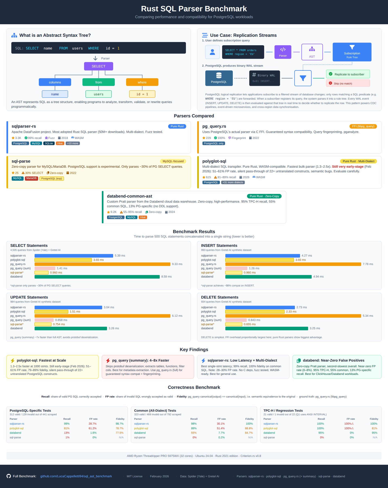
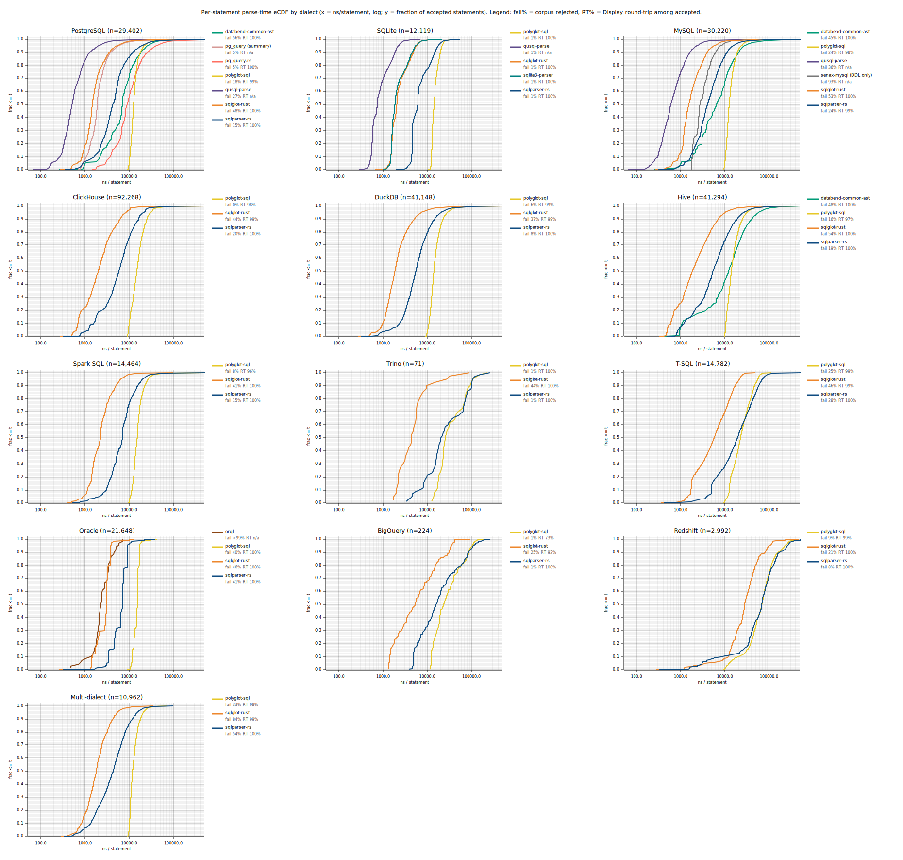

# SQL Parser Benchmark

[](https://github.com/LucaCappelletti94/sql_ast_benchmark/actions/workflows/ci.yml)
[](LICENSE)
[](https://www.rust-lang.org)

Benchmarking Rust SQL parsers using real-world PostgreSQL statements.

## Parsers Under Test

| Parser                                                                           | Version | Commit                                                                                                      | Implementation                    |
| -------------------------------------------------------------------------------- | ------- | ----------------------------------------------------------------------------------------------------------- | --------------------------------- |
| **[sqlparser-rs](https://github.com/sqlparser-rs/sqlparser-rs)**                 | 0.61.0  | [`d9b53a0`](https://github.com/sqlparser-rs/sqlparser-rs/commit/d9b53a0cdb369124d9b6ce6237959e66bad859af)   | Pure Rust (multi-dialect)         |
| **[polyglot-sql](https://github.com/tobilg/polyglot)**                           | 0.1.8   | [`b5e23ec`](https://github.com/tobilg/polyglot/commit/b5e23ec24a053e6a19f4219a82693c8937c50ca8)             | Pure Rust (multi-dialect)         |
| **[pg_query.rs](https://github.com/pganalyze/pg_query.rs)**                      | 6.1.1   | [`35b8783`](https://github.com/pganalyze/pg_query.rs/commit/35b8783fda79636dd29d787765ca4a0978788f96)       | Rust FFI to C (libpg_query)       |
| **[sql-parse](https://github.com/antialize/sql-parse)**                          | 0.28.0  | [`ac352f9`](https://github.com/antialize/sql-parse/commit/ac352f97f7ef13ebc44af9295a08095d89882319)         | Pure Rust (zero-copy)             |
| **[databend-common-ast](https://github.com/datafuselabs/databend)**              | 0.2.4   | (crates.io release)                                                                                         | Pure Rust (zero-copy, custom)     |

### Parser Descriptions

- **sqlparser-rs**: A handwritten recursive descent parser supporting multiple SQL dialects (PostgreSQL, MySQL, SQLite, etc.). No external C dependencies. The most widely adopted Rust SQL parser.

- **polyglot-sql**: A SQL parsing, formatting, and dialect-transpilation library. Pure Rust, WASM-compatible. **The library is still very early-stage** (first release Feb 2026): correctness testing reveals a ~52–61% false-positive rate (it accepts large amounts of SQL that PostgreSQL itself rejects), and real-world translation testing shows widespread silent pass-through failures — 22+ PostgreSQL functions and constructs are emitted verbatim rather than translated (e.g. `LEAST`, `GREATEST`, `DATE_TRUNC`, `JSON_AGG`, `EXTRACT`, `AT TIME ZONE`), DDL types such as `TIMESTAMPTZ` and `TSVECTOR` are not mapped, and `GRANT`/`REVOKE`/`CREATE ROLE` are emitted as-is. A semantic correctness bug misidentifies `<=>` as `IS NOT DISTINCT FROM`. Evaluate carefully before production use.

- **pg_query.rs**: Rust bindings to libpg_query, which embeds PostgreSQL's actual parser extracted from the PostgreSQL source code. Provides 100% compatibility with PostgreSQL syntax.

- **pg_query.rs (summary)**: The `pg_query::summary()` function extracts metadata (tables, functions, filter columns, statement types) without deserializing the full AST over protobuf. According to pg_query documentation, this can provide up to an order of magnitude performance improvement over full parsing.

- **sql-parse**: A zero-copy parser using borrowed tokens for minimal allocations. Primarily focused on MySQL/MariaDB with experimental PostgreSQL support.

- **databend-common-ast**: A custom SQL parser built from scratch by the Databend cloud data warehouse team after sqlparser-rs became a performance bottleneck. Uses zero-copy parsing with Pratt expression parsing and logos-based lexing. Supports multiple SQL dialects including a PostgreSQL-compatible mode.

All parsers are configured for PostgreSQL dialect in this benchmark.

### Project Health & Metrics

| Metric                      | sqlparser-rs        | polyglot-sql    | pg_query.rs     | sql-parse  | databend-common-ast |
| --------------------------- | ------------------: | --------------: | --------------: | ---------: | ------------------: |
| **GitHub Stars**            |               3,323 |             615 |             229 |         25 |            9,163    |
| **Total Downloads**         |               50.8M |            <1K  |            1.0M |        53K |                 21K |
| **Recent Downloads** (90d)  |                9.9M |            <1K  |            129K |      1.7K  |               2.6K  |
| **Last Commit**             |            Feb 2026 |        Feb 2026 |        Dec 2025 |   Oct 2025 |            Jan 2026 |
| **First Release**           |            Feb 2018 |        Feb 2026 |        Jan 2022 |   Jan 2022 |            Jun 2024 |
| **License**                 |          Apache-2.0 |     Apache-2.0  |             MIT | Apache-2.0 |          Apache-2.0 |
| **Dependencies**            |            0 (core) |        0 (core) | C (libpg_query) |          0 |             0 (core)|
| **WASM Support**            |                 Yes |             Yes |              No |        Yes |                  No |
| **Multi-dialect support**   |                 Yes |  Claims 32 (early-stage; see description) |      PG only    |    MySQL+  |         Yes (4+)    |
| **Maintainer**              | Apache (DataFusion) |      Individual |       pganalyze | Individual |    Databend Labs    |

**Key observations:**

- **sqlparser-rs** is by far the most mature and widely adopted, with 50x more downloads than the next closest competitor. It's now part of the Apache DataFusion project, ensuring long-term maintenance.
- **polyglot-sql** is brand new (Feb 2026) and still very early-stage. It claims 32-dialect support, but correctness testing shows a ~52–61% false-positive rate, and translation testing reveals widespread silent pass-through failures (22+ constructs not translated, semantic correctness bugs). Treat with caution in any production context.
- **pg_query.rs** has solid adoption (1M downloads) and is maintained by pganalyze, a company that uses it in production for PostgreSQL query analysis.
- **databend-common-ast** was purpose-built to overcome sqlparser-rs performance bottlenecks. The crate is extracted from the larger Databend project (8K+ stars).
- **sql-parse** is a smaller project with limited maintainer bandwidth, primarily targeting MySQL/MariaDB.

### Correctness Benchmark

Parser correctness is evaluated against SQL statements scraped from the sqlparser-rs test suite and filtered/scored using **pg_query.rs (libpg_query) as ground truth** — the actual PostgreSQL parser. Four metrics are reported:

- **Recall**: of SQL that pg_query accepts as valid PostgreSQL, how many does this parser also accept? ↑ higher is better
- **False-positive rate**: of SQL that pg_query rejects as invalid PostgreSQL, how many does this parser wrongly accept? ↓ lower is better
- **Round-trip stability**: of valid SQL the parser accepts, does `parse → print → re-parse → re-print` produce identical output? ↑ higher is better (N/A for parsers without a pretty-printer)
- **Fidelity**: of valid SQL the parser accepts, does `pg_query_canonical(parser_output) == pg_query_canonical(original)`? Tests whether the parser's AST is semantically equivalent to the input, not just self-consistent. ↑ higher is better (N/A for parsers without a pretty-printer)

Run the correctness benchmark yourself:

```bash
cargo run --bin scrape_tests   # extract SQL from sqlparser-rs test suite
cargo run --bin correctness    # score all parsers
```

#### PostgreSQL-specific tests (312 pg_query-valid / 129 pg_query-invalid out of 441 scraped)

| Parser                | Recall        | False-positive rate  | Round-trip         | Fidelity           |
| --------------------- | ------------: | -------------------: | -----------------: | -----------------: |
| pg_query.rs (baseline)| 312/312  100% | 0/129   0%           | 310/312  **99.4%** | 100% (by def.)     |
| pg_query (summary)    | 312/312  100% | 0/129   0%           | N/A                | N/A                |
| sqlparser-rs          | 310/312   99% | 37/129 **28.7%**     | 310/310  **100%**  | 306/310  **98.7%** |
| polyglot-sql          | 254/312   81% | 79/129 **61.2%**     | 247/254   97.2%    | 200/254   78.7%    |
| databend-common-ast   |  40/312   13% |  2/129   1.6%        |  40/40   100%      |  31/40    77.5%    |
| sql-parse             |   3/312    1% |  0/129   0.0%        | N/A                | N/A                |

#### Common (all-dialect) tests (323 pg_query-valid / 469 pg_query-invalid out of 792 scraped)

| Parser                | Recall        | False-positive rate  | Round-trip         | Fidelity           |
| --------------------- | ------------: | -------------------: | -----------------: | -----------------: |
| pg_query.rs (baseline)| 323/323  100% | 0/469   0%           | 323/323  **100%**  | 100% (by def.)     |
| pg_query (summary)    | 323/323  100% | 0/469   0%           | N/A                | N/A                |
| sqlparser-rs          | 318/323   98% | 141/469 **30.1%**    | 318/318  **100%**  | 318/318  **100%**  |
| polyglot-sql          | 286/323   89% | 241/469 **51.4%**    | 282/286   98.6%    | 254/286   88.8%    |
| databend-common-ast   | 177/323   55% |  36/469   7.7%       | 177/177  100%      | 150/177   84.7%    |
| sql-parse             |   1/323    0% |   1/469   0.2%       | N/A                | N/A                |

#### TPC-H / Regression tests (21 pg_query-valid / 1 pg_query-invalid out of 22 scraped)

| Parser                | Recall        | False-positive rate  | Round-trip         | Fidelity           |
| --------------------- | ------------: | -------------------: | -----------------: | -----------------: |
| pg_query.rs (baseline)| 21/21   100%  | 0/1   0%             | 21/21   100%       | 100% (by def.)     |
| pg_query (summary)    | 21/21   100%  | 0/1   0%             | N/A                | N/A                |
| sqlparser-rs          | 21/21   100%  | 1/1 **100%**         | 21/21   100%       | 21/21   **100%**   |
| polyglot-sql          | 21/21   100%  | 1/1 **100%**         | 21/21   100%       | 17/21    81.0%     |
| databend-common-ast   | 20/21    95%  | 0/1   0%             | 20/20   100%       | 19/20    95.0%     |
| sql-parse             |  0/21     0%  | 0/1   0%             | N/A                | N/A                |

**Key correctness findings:**

- **sqlparser-rs** has excellent recall (98–100%) but a significant false-positive problem: it accepts ~29–30% of SQL that PostgreSQL itself rejects. Its "PostgreSQL dialect" is looser than actual PostgreSQL. Round-trip is perfect. Fidelity is excellent: 98.7% on PG-specific, 100% on common and TPC-H — what it parses is almost always semantically correct.
- **polyglot-sql** has lower recall (81–89%) and the highest false-positive rate (51–61%), accepting more than half of invalid-PostgreSQL SQL. Near-perfect round-trip (97–99%) but noticeably lower fidelity (78–89%): even when it accepts valid SQL and reprints it stably, the output does not always preserve the original semantics.
- **databend-common-ast** has low recall on PG-specific tests (13% — it doesn't handle DDL/PG extensions) but decent recall on standard SQL (55% common, 95% TPC-H). Very low false-positive rate (2–8%). Perfect round-trip for what it accepts, but fidelity is lower (77–95%): it parses common SQL and TPC-H accurately but makes more semantic errors on PG-specific constructs.
- **sql-parse** is effectively not a PostgreSQL parser. It accepts almost nothing from PG-specific or TPC-H tests, and has near-zero false positives only because it rejects almost everything.
- **pg_query (summary)** matches full pg_query exactly on accept/reject decisions, confirming it uses the same underlying parse logic.
- **pg_query.rs round-trip**: 100% on common and TPC-H. On PostgreSQL-specific tests it scores 310/312 (99.4%) — two statements are accepted and deparsed but the deparsed form does not re-parse identically, indicating a minor fidelity gap in the libpg_query deparser. Note: 4 statements were removed from the corpus before this run after being found to trigger a C-level `abort()` in the libpg_query deparser (non-PostgreSQL constructs: `ENUM8`/`ENUM16` and `struct<a,b>` syntax); a bug report has been [filed upstream](https://github.com/pganalyze/libpg_query/issues).

### Benchmark Dataset Coverage

Not all parsers successfully parse all statements in the performance benchmark corpus. Coverage was measured against our real-world PostgreSQL statement corpus (Spider + Gretel datasets, validated with pg_query.rs):

| Parser                | SELECT    | INSERT | UPDATE | DELETE |
| --------------------- | --------: | -----: | -----: | -----: |
| sqlparser-rs          |      100% |   100% |   100% |   100% |
| polyglot-sql          |      100% |   100% |  99.8% |   100% |
| pg_query.rs           |      100% |   100% |   100% |   100% |
| pg_query.rs (summary) |      100% |   100% |   100% |   100% |
| databend-common-ast   |   **99.2%**| **94.3%**| **98.2%**| **97.3%**|
| sql-parse             | **30.1%** |  97.8% |  95.8% |  95.7% |

**⚠️ sql-parse**: Only ~30% of SELECT statements parse successfully — it is primarily a MySQL/MariaDB parser. Speed results for sql-parse SELECT benchmarks reflect only the simpler subset of statements it can handle.

**⚠️ databend-common-ast**: Fails on some PostgreSQL-specific constructs (`RETURNING`, certain type casts, PG-specific syntax). The ~1–6% failure rate is small but reflects its Databend/ClickHouse dialect focus.

## Benchmark Methodology

### What is Measured

Each benchmark measures the time to parse a batch of SQL statements concatenated with semicolons into a single string. For example, parsing 100 statements means parsing a string like:

```sql
SELECT * FROM t1; SELECT * FROM t2; ... ; SELECT * FROM t100
```

The parser must tokenize and build an AST for all statements in the batch. We measure wall-clock time for the complete parsing operation.

**Note on databend-common-ast**: The databend parser API parses one statement per call (tokenize + parse). The benchmark splits the concatenated input on `;` and calls the parser once per statement, which matches the natural API contract.

### Benchmark Configuration

- **Framework**: [Criterion.rs](https://github.com/bheisler/criterion.rs) v0.8
- **Sampling**: Flat sampling mode, 50 samples per benchmark
- **Measurement time**: 3 seconds per benchmark
- **Batch sizes**: 1, 10, 50, 100, 500, 1000 statements (plus full corpus size for INSERT/UPDATE/DELETE)

### Datasets

All SQL statements are validated to parse successfully with both sqlparser-rs and pg_query.rs before inclusion in the performance benchmark. Other parsers may fail on some statements (see Benchmark Dataset Coverage above).

| Dataset       | Source                                                                       | Count | Description                                                                                    |
| ------------- | ---------------------------------------------------------------------------- | ----: | ---------------------------------------------------------------------------------------------- |
| Spider SELECT | [Yale Spider](https://yale-lily.github.io/spider)                            | 4,505 | Real queries from the Spider text-to-SQL benchmark, covering 200 databases across 138 domains |
| Gretel SELECT | [Gretel AI](https://huggingface.co/datasets/gretelai/synthetic_text_to_sql)  | 1,897 | Synthetic queries generated by LLMs, designed to be realistic                                 |
| Gretel INSERT | Gretel AI                                                                    |   993 | INSERT statements with VALUES and subqueries                                                  |
| Gretel UPDATE | Gretel AI                                                                    |   984 | UPDATE statements with WHERE clauses and expressions                                          |
| Gretel DELETE | Gretel AI                                                                    |   934 | DELETE statements with subqueries and conditions                                              |

## Results

A high-level visual summary is available as an infographic:

[](infographic.svg)

Performance charts (log-log scale):



### SELECT Statements

| Statements | sqlparser-rs | polyglot-sql | pg_query.rs  | pg_query (sum) | sql-parse | databend |
| ---------: | -----------: | -----------: | -----------: | -------------: | --------: | -------: |
|          1 |       6.6 µs |      29.8 µs |      11.0 µs |         2.5 µs |    1.1 µs |  11.2 µs |
|         10 |     124.9 µs |     120.6 µs |     198.5 µs |        30.0 µs |   19.2 µs | 184.7 µs |
|         50 |     449.0 µs |     370.0 µs |     792.7 µs |       122.7 µs |   79.1 µs | 725.8 µs |
|        100 |     800.6 µs |     715.5 µs |      1.44 ms |       226.4 µs |  152.4 µs |  1.37 ms |
|        500 |      5.39 ms |      3.93 ms |      9.33 ms |        1.41 ms |  959.7 µs |  8.59 ms |
|       1000 |     10.09 ms |      7.79 ms |     17.67 ms |        2.55 ms |   1.81 ms | 16.16 ms |

### INSERT Statements

| Statements | sqlparser-rs | polyglot-sql | pg_query.rs  | pg_query (sum) | sql-parse | databend |
| ---------: | -----------: | -----------: | -----------: | -------------: | --------: | -------: |
|          1 |       5.0 µs |      27.3 µs |      10.4 µs |         2.3 µs |   0.98 µs |   4.7 µs |
|         10 |      83.7 µs |     103.4 µs |     157.6 µs |        24.3 µs |   16.1 µs | 157.7 µs |
|         50 |     395.7 µs |     395.8 µs |     731.0 µs |       115.1 µs |   76.2 µs | 494.4 µs |
|        100 |     842.1 µs |     794.7 µs |      1.49 ms |       248.3 µs |  166.5 µs | 989.2 µs |
|        500 |      4.27 ms |      3.93 ms |      7.78 ms |        1.26 ms |  960.2 µs |  4.94 ms |
|        993 |      8.37 ms |      7.22 ms |     15.72 ms |        2.34 ms |   1.80 ms |  9.07 ms |

### UPDATE Statements

| Statements | sqlparser-rs | polyglot-sql | pg_query.rs  | pg_query (sum) | sql-parse | databend |
| ---------: | -----------: | -----------: | -----------: | -------------: | --------: | -------: |
|          1 |       6.2 µs |      28.0 µs |      15.3 µs |         2.3 µs |    1.2 µs |   5.2 µs |
|         10 |      52.3 µs |      67.7 µs |     104.5 µs |        14.8 µs |   11.4 µs |  42.4 µs |
|         50 |     303.4 µs |     285.0 µs |     582.4 µs |        77.6 µs |   63.6 µs | 337.5 µs |
|        100 |     664.1 µs |     587.6 µs |      1.28 ms |       177.9 µs |  144.6 µs | 713.5 µs |
|        500 |      3.04 ms |      1.51 ms |      6.12 ms |       858.0 µs |  753.5 µs |  3.26 ms |
|        984 |      6.23 ms |      2.44 ms |     12.81 ms |        1.73 ms |   1.55 ms |  6.65 ms |

### DELETE Statements

| Statements | sqlparser-rs | polyglot-sql | pg_query.rs  | pg_query (sum) | sql-parse | databend |
| ---------: | -----------: | -----------: | -----------: | -------------: | --------: | -------: |
|          1 |       3.3 µs |      25.3 µs |       7.1 µs |         1.7 µs |   0.64 µs |   2.6 µs |
|         10 |      68.6 µs |      87.2 µs |     144.4 µs |        19.1 µs |   12.9 µs |  74.6 µs |
|         50 |     275.0 µs |     262.2 µs |     536.0 µs |        79.1 µs |   54.1 µs | 252.8 µs |
|        100 |     559.3 µs |     499.7 µs |      1.07 ms |       163.5 µs |  118.5 µs | 551.1 µs |
|        500 |      2.73 ms |      2.33 ms |      5.34 ms |       842.6 µs |  654.5 µs |  3.25 ms |
|        934 |      5.53 ms |      4.35 ms |     10.41 ms |        1.53 ms |   1.25 ms |  6.09 ms |

### Mixed DML Statements

All statement types combined (SELECT + INSERT + UPDATE + DELETE), reflecting a realistic workload.

| Statements | sqlparser-rs | polyglot-sql | pg_query.rs  | pg_query (sum) | sql-parse | databend |
| ---------: | -----------: | -----------: | -----------: | -------------: | --------: | -------: |
|          1 |       6.6 µs |      29.3 µs |      11.1 µs |         2.5 µs |    1.1 µs |  11.5 µs |
|         10 |     126.1 µs |     114.7 µs |     196.3 µs |        30.0 µs |   19.4 µs | 183.9 µs |
|         50 |     444.0 µs |     363.2 µs |     798.9 µs |       120.7 µs |   78.4 µs | 729.8 µs |
|        100 |     820.4 µs |     705.5 µs |      1.46 ms |       227.1 µs |  153.8 µs |  1.37 ms |
|        500 |      5.28 ms |      3.92 ms |      9.22 ms |        1.41 ms |  968.0 µs |  8.71 ms |
|       1000 |     10.19 ms |      7.78 ms |     18.03 ms |        2.53 ms |   1.84 ms | 16.26 ms |

## Interpretation

### Performance Ranking

Across all statement types and batch sizes, the parsers consistently rank from fastest to slowest:

1. **sql-parse** — fastest for full AST parsing (~4x faster than sqlparser-rs), but only parses ~30% of SELECT statements
2. **pg_query.rs (summary)** — fastest for metadata extraction; no full AST deserialization
3. **polyglot-sql** — 1.3–2.5x faster than sqlparser-rs at scale; notable high per-call overhead
4. **sqlparser-rs** — solid all-rounder; fastest at single-statement latency among full AST parsers
5. **databend-common-ast** — comparable to sqlparser-rs (within 10–20%), slightly slower
6. **pg_query.rs** — full PostgreSQL AST with 100% PG compatibility; slowest due to FFI + protobuf

### Key Findings

#### 1. polyglot-sql has high per-call overhead but strong throughput at scale

At a single statement, polyglot-sql (29–30 µs) is 4–5x slower than sqlparser-rs (6–7 µs). But at 1000 statements it is 1.3x faster (7.79 ms vs 10.09 ms). The crossover occurs at roughly 10 statements. For UPDATE statements the advantage is especially pronounced: at 984 statements polyglot-sql is **2.5x faster** than sqlparser-rs (2.44 ms vs 6.23 ms). This points to an internal representation or parsing strategy that amortizes well over many statements.

#### 2. pg_query (summary) is dramatically faster for metadata extraction

The `pg_query::summary()` function is **4–8x faster** than full `pg_query::parse()` because it extracts metadata (tables, functions, filter columns, statement types) directly in C without deserializing the full AST over protobuf. For 500 SELECT statements: 1.41 ms (summary) vs 9.33 ms (full parse). Use this when you need query metadata but not the complete AST.

#### 3. databend-common-ast is competitive with sqlparser-rs in performance

databend was built to be faster than sqlparser-rs, yet in this benchmark it performs comparably — within 10–20% on most workloads and occasionally slower (especially for INSERT at larger batch sizes). Its main advantage over sqlparser-rs is architectural (zero-copy, Pratt parsing) and may show more in parsing very long or complex individual statements. Dataset coverage is good (99.2% SELECT, 94.3–98.2% INSERT/UPDATE/DELETE), though correctness testing shows limited recall on PG-specific syntax (13% on PG-specific tests, 55% on common SQL, 95% on TPC-H) with a near-zero false-positive rate.

#### 4. sql-parse is the fastest full AST parser, but with major caveats

sql-parse achieves its speed through zero-copy parsing with borrowed tokens, minimizing allocations. However, it only successfully parses ~30% of SELECT statements in our corpus due to incomplete PostgreSQL dialect support. For INSERT/UPDATE/DELETE its compatibility is ~96–98%, and it is the fastest full-AST parser for those statement types.

#### 5. sqlparser-rs offers the best speed/compatibility balance for single statements

At the single-statement level, sqlparser-rs (6–7 µs) is faster than polyglot-sql (29–30 µs) and databend (4.7–11.2 µs, varies by type). For applications that parse statements one at a time (query analyzers, middleware), sqlparser-rs has an advantage. For bulk parsing pipelines processing many statements, polyglot-sql may be preferable.

#### 6. FFI overhead is measurable but not dominant

pg_query.rs (wrapping libpg_query via FFI) is 1.5–2x slower than pure Rust parsers. This overhead comes from crossing the Rust-C boundary, converting protobuf data structures to Rust types, and the PostgreSQL parser's design for correctness over speed.

#### 7. All parsers scale linearly

Parsing time grows linearly with statement count, as expected. No parser shows degradation at scale.

### Trade-offs

| Consideration                | sqlparser-rs                    | polyglot-sql                    | pg_query.rs (full)          | pg_query.rs (summary)        | sql-parse                 | databend-common-ast            |
| ---------------------------- | ------------------------------- | ------------------------------- | --------------------------- | ---------------------------- | ------------------------- | ------------------------------ |
| **Speed (single stmt)**      | Fast                            | Slow (high overhead)            | Slower (FFI + protobuf)     | Fastest FFI (no protobuf)    | Fastest (zero-copy)       | Fast (comparable to sqlparser) |
| **Speed (bulk)**             | Good                            | Fastest (amortizes well)        | Slow                        | Very fast                    | Fastest                   | Good                           |
| **Output**                   | Full AST                        | Full AST + transpile            | Full AST                    | Metadata only                | Full AST                  | Full AST                       |
| **PostgreSQL compatibility** | Good recall (99%) but ~29% FP rate — accepts non-PG SQL | Moderate recall (81–89%), high FP rate (~52–61%) | Perfect (actual PG parser)  | Perfect (actual PG parser)   | Minimal — MySQL-only in practice | Moderate recall (55% common, 95% TPC-H), low FP rate (~8%) |
| **Memory allocation**        | Standard                        | Standard                        | Standard                    | Minimal                      | Minimal (borrowed tokens) | Minimal (zero-copy)            |
| **Dependencies**             | None                            | None                            | C library (libpg_query)     | C library (libpg_query)      | None                      | None                           |
| **Multi-dialect support**    | Yes (MySQL, SQLite, etc.)       | Claims 32 (early-stage; widespread translation failures) | PostgreSQL only             | PostgreSQL only              | MySQL/MariaDB focus       | Yes (PG, MySQL, Hive, PRQL)    |
| **WASM Support**             | Yes                             | Yes                             | No                          | No                           | Yes                       | No                             |

### Recommendations

- **General use**: **sqlparser-rs** — best balance of speed, recall, and multi-dialect support; lowest single-statement latency; perfect round-trip. Caveat: ~29% false-positive rate on non-PostgreSQL SQL.
- **Strict PostgreSQL validation**: **pg_query.rs** — the only parser with zero false positives; accepts exactly what PostgreSQL accepts. Use when correctness matters more than speed.
- **Metadata extraction** (tables, functions, columns): **pg_query.rs (summary)** — 4–8x faster than full parsing, perfect PostgreSQL correctness.
- **Bulk parsing pipelines** (many statements, no strict dialect validation needed): **polyglot-sql** may offer the fastest throughput at scale, but is still very early-stage (Feb 2026). Expect silent translation failures, semantic bugs, and a ~52–61% false-positive rate. Not recommended for production without thorough evaluation.
- **Embedded/WASM targets**: **sqlparser-rs**, **polyglot-sql**, or **sql-parse** — no C dependencies.
- **Custom PostgreSQL-compatible parsing with performance focus**: **databend-common-ast** — purpose-built for speed; low false-positive rate but limited recall on PG-specific syntax.

## Environment

Benchmarks were run on:

- **CPU**: AMD Ryzen Threadripper PRO 5975WX (32 cores, 64 threads)
- **OS**: Ubuntu 24.04 (Linux 6.17)
- **Rust**: 2021 edition (stable)

### System Requirements

- **Rust toolchain**: stable (2021 edition)
- **C compiler**: Required for pg_query.rs (builds libpg_query from source)
- **libclang**: Required for bindgen (used by FFI parsers)

On Ubuntu/Debian:

```bash
sudo apt install build-essential libclang-dev
```

## Running Benchmarks

```bash
cargo bench
```

Results are saved to `target/criterion/` with HTML reports.

> **Note**: pg_parse (a second binding to libpg_query with a different API) has been removed from the benchmark as it is fully superseded by pg_query.rs. Historical results for SELECT 1000: ~16.4 ms.

## Generating Plots

```bash
cargo run --release --bin plot
```

Creates `benchmark_results.svg` with log-log scale line charts comparing all parser configurations.

## Analysis Utilities

### Divergence analysis

Shows SQL statements where sqlparser-rs and pg_query.rs disagree, using pg_query as PostgreSQL ground truth:

```bash
cargo run --bin scrape_tests  # required first
cargo run --bin divergence
```

Reports two categories: statements sqlparser-rs accepts but pg_query rejects (false positives / over-permissive dialect) and statements pg_query accepts but sqlparser-rs rejects (missing coverage).

### Deparse crash detection

Identifies SQL statements that trigger a C-level `abort()` (`SIGABRT`) inside libpg_query's deparser, which cannot be caught by Rust's `catch_unwind`:

```bash
cargo run --bin scrape_tests  # required first
cargo run --bin check_deparse
```

Runs each statement in an isolated subprocess and inspects the exit status to detect SIGABRT. The four crashing statements found (non-PostgreSQL constructs like `ENUM8` and `struct<a,b>`) were removed from the correctness corpus.

## Reproducibility

This benchmark uses git dependencies to track the latest versions of each parser. For exact reproducibility:

1. The commit hashes in the "Parsers Under Test" table indicate the exact versions benchmarked
2. Benchmark results may vary between runs due to system load and thermal conditions

To pin specific versions, replace git dependencies in `Cargo.toml` with version numbers from crates.io.

## Development

### Pre-commit Hooks

This project includes pre-commit hooks for formatting and linting. To enable:

```bash
git config core.hooksPath .githooks
```

The hook runs `cargo fmt --check` and `cargo clippy` before each commit.

### Code Style

- Format with `cargo fmt`
- Lint with `cargo clippy` (pedantic + nursery warnings enabled)
- No unsafe code allowed

## License

MIT
